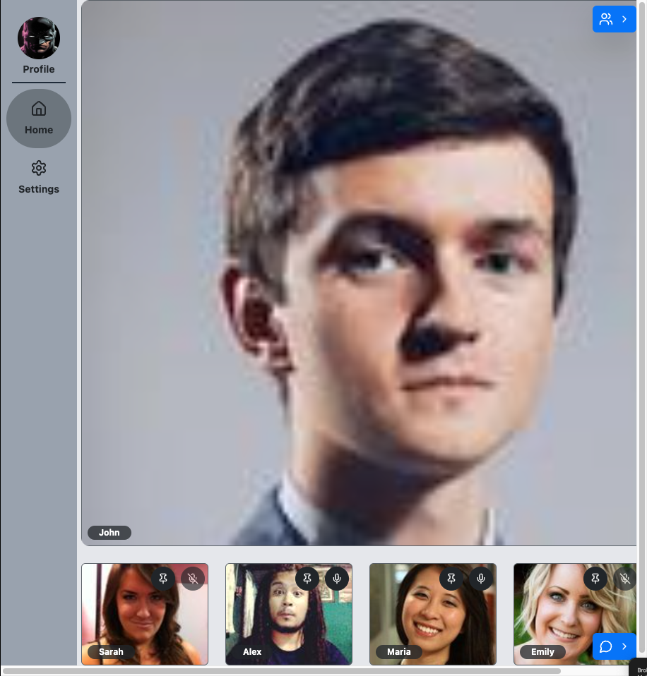
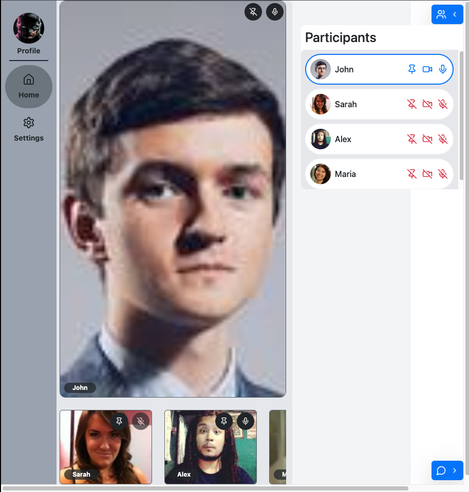

# Real-Time Video Conference Platform

A high-performance video conferencing solution with integrated ephemeral messaging, built using modern technologies for optimal performance and scalability.

## Key Features ✨

**🎥 Core Video Features**

- WebRTC-based peer-to-peer video/audio
- Screen sharing with resolution control
- Dynamic bandwidth adaptation
- Room-based access via unique IDs
- Participant pinning (spotlight)

**💬 Real-Time Messaging**

- Redis Pub/Sub for instant messaging
- Ephemeral message storage (call duration only)
- Emoji reactions & message formatting
- Message history per session
- Typing indicators

**🛠️ Participant Controls**

- Individual audio/video mute
- Connection quality monitoring
- Participant role management
- Temporary ban capabilities
- Volume controls per participant

**🔒 Room Management**

- Password-protected rooms
- Auto-expiring sessions
- Participant capacity limits
- Persistent room configurations (PostgreSQL)
- Admin dashboard for moderation

## Technology Stack ⚙️

**Frontend**

- React + TypeScript
- WebRTC (Pion for Go integration)
- Tailwind CSS + Headless UI
- Redux Toolkit + React Query

**Backend (Go)**

- fiber framework
- PostgreSQL (Room metadata)
- Redis 7+ (Pub/Sub messaging)
- gRPC for internal services
- WebSocket (Gorilla)

## Architecture Overview 🏗️

